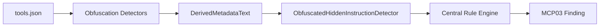

# Detectors 2 비교 및 적용 권고

비교 대상:

- 현재 프로젝트: `detectors/`
- 비교 대상 폴더: `/Users/yang-geunsang/Downloads/detectors 2/`

작성일: 2026-06-23

## 1. 결론

`detectors 2`는 현재 프로젝트가 이미 적용한 선택안 B 구조를 기반으로, **성능 최적화와 evidence 보강을 추가한 변형 버전**으로 보입니다.

즉, 구조 방향은 현재 프로젝트와 같습니다.



다만 `detectors 2`에는 다음 특징이 추가되어 있습니다.

- detector-level cache 관리용 `cache.py`
- `text_matching.py`의 prepared text cache
- `rule_engine.py`의 compiled regex cache
- `encoded_payload`, `html_comment`, `homoglyph`, `unicode_obfuscation` 일부 함수의 `lru_cache`
- `obfuscated_hidden_instruction` evidence 보강

따라서 `detectors 2`를 그대로 덮어쓰기보다는, **성능 캐시와 evidence 보강 아이디어만 선별적으로 가져오는 방향**이 안전합니다.

## 2. 한눈에 보는 차이

| 구분 | 현재 프로젝트 `detectors/` | `Downloads/detectors 2/` |
| --- | --- | --- |
| 기본 구조 | 선택안 B 중앙 pipeline 적용 | 선택안 B 중앙 pipeline 적용 |
| 캐시 관리 | 없음 | `cache.py`로 detector cache clear/info/scope 제공 |
| Rule engine | `lru_cache`로 YAML rule 로딩 | YAML rule 캐시 + regex compile 캐시 + prepared text 재사용 |
| Text matching | 매칭마다 normalize/tokenize 수행 | `PreparedText`를 만들어 normalize/tokenize 재사용 |
| Obfuscation helper | 직접 계산 중심 | 일부 탐지 함수에 `lru_cache(maxsize=2048)` 적용 |
| Evidence | `matched_on: canonical`, `canonical_excerpt`, `matched_rules` 중심 | `severity_rationale`, `match_type`, `match_method`, `matched_text`, `transforms` 추가 |
| Semantic 입력 정제 | `text_chunks.py` 기반 구조값 제외 | 자체 필터 기반. 최소 글자/단어 수, chunk 수 제한 |
| Finding aggregation | 현재 프로젝트에 `finding_aggregation.py` 있음 | 없음 |
| 적용 위험 | 현재 테스트 통과 상태 | 성능 개선은 좋아 보이나 오탐 수치 재검증 필요 |

## 3. 파일 구성 차이

`detectors 2`에만 있는 파일:

- `detectors/cache.py`

현재 프로젝트에만 있는 파일:

- `detectors/tool_poisoning/finding_aggregation.py`

둘 다 선택안 B 구조 자체를 뒤집는 파일은 아닙니다.

`cache.py`는 성능과 메모리 관리를 위한 보조 파일이고, `finding_aggregation.py`는 향후 report dedup/grouping을 위한 보조 파일입니다. 두 파일은 서로 대체 관계가 아니라 함께 존재할 수 있습니다.

## 4. detectors 2의 주요 개선점

### 4.1 detector cache 관리

`detectors 2`에는 `cache.py`가 있습니다.

주요 함수:

```python
clear_detector_caches()
detector_cache_info()
detector_cache_scope(clear_before=False, clear_after=True)
```

이 파일은 여러 detector의 `lru_cache`를 한 번에 비우거나 cache hit/miss 정보를 확인하기 위한 관리 계층입니다.

대상 cache는 다음과 같습니다.

- `rule_engine.load_rules`
- `text_matching.prepare_text_for_match`
- `text_matching.keyword_match_parts`
- `encoded_payload.find_decoded_payloads`
- `unicode_obfuscation.detect_chars`
- `unicode_obfuscation.normalize_text`
- `homoglyph.detect_homoglyphs`
- `homoglyph.skeletonize_confusables`
- `html_comment.find_markup_hidden_texts`
- `semantic_similarity.keyword_rule_signatures`

이 아이디어는 좋습니다. vulnerable-lab, benign-lab, snyk-aligned처럼 많은 fixture를 반복 스캔할 때 중복 계산을 줄일 수 있습니다.

다만 캐시는 scanned metadata text를 메모리에 잠시 보관할 수 있으므로, 사용자 입력이나 민감 문자열을 검사하는 CLI/웹 환경에서는 scan 종료 후 cache clear 정책을 같이 가져와야 합니다.

## 5. Rule Engine 차이

현재 프로젝트의 `rule_engine.py`는 YAML rule 로딩에 `lru_cache`를 사용하고, keyword/regex rule을 검사합니다.

`detectors 2`는 여기에 다음 최적화를 추가했습니다.

```python
prepared_text = prepare_text_for_match(text)
```

즉, 같은 text에 대해 rule 여러 개를 검사할 때 normalize/tokenize를 매번 반복하지 않고 한 번만 수행합니다.

또 regex rule은 `_compiled_patterns`로 미리 컴파일합니다.

```python
copied["_compiled_patterns"] = [
    re.compile(str(pattern), flags=re.IGNORECASE)
    for pattern in copied["patterns"]
]
```

이 변화는 성능상 유리합니다.

특히 rule이 늘어나거나 text chunk가 많아질수록 효과가 있습니다. 현재 프로젝트에서도 가져올 가치가 큽니다.

## 6. Text Matching 차이

`detectors 2`의 `text_matching.py`에는 `PreparedText`가 추가되어 있습니다.

```python
@dataclass(frozen=True)
class PreparedText:
    normalized: str
    tokens: tuple[str, ...]
```

그리고 `prepare_text_for_match()`가 `lru_cache(maxsize=2048)`로 감싸져 있습니다.

이 구조는 다음 문제를 줄입니다.

- 같은 text를 rule마다 반복 normalize하는 비용
- 같은 keyword를 반복 tokenize하는 비용
- regex trigger 검사 시 keyword matching을 반복하는 비용

이 개선은 탐지 결과의 의미를 바꾸기보다 성능을 개선하는 성격이므로, 현재 프로젝트에 비교적 안전하게 반영할 수 있습니다.

## 7. Obfuscation Detector 차이

### 7.1 Encoded Payload

`detectors 2`의 `encoded_payload.py`는 `find_decoded_payloads()`에 cache를 붙였습니다.

```python
@lru_cache(maxsize=2048)
def find_decoded_payloads(...)
```

반복 스캔 성능에는 유리합니다.

다만 주의할 점도 있습니다. `detectors 2` 버전은 짧은 base64, hex, octal, HTML entity, ROT13 후보에 대해 기존의 `require_suspicious` gate를 제거한 형태입니다.

이 변화는 미탐을 줄일 수 있지만, benign encoded content에서 오탐을 늘릴 가능성이 있습니다.

현재 improve benign-lab 재검증에서 이미 `BENIGN-032-url-encoding-doc`이 1건 잡히고 있으므로, encoded payload gate를 더 느슨하게 가져오면 benign 오탐이 늘 수 있습니다.

따라서 이 부분은 그대로 덮어쓰기보다 다음처럼 선별 적용하는 것이 좋습니다.

- cache 적용은 검토 가능
- `require_suspicious` 완화는 benign-lab, general-benign, snyk benign control 재검증 후 적용

### 7.2 HTML Comment

`detectors 2`의 `html_comment.py`는 `MarkupHiddenText` dataclass와 `find_markup_hidden_texts()`를 추가했습니다.

```python
@dataclass(frozen=True)
class MarkupHiddenText:
    markup_type: str
    category: str
    prefix: str
    title: str
    recommendation: str
    hidden_text: str
    full_match: str
    span: tuple[int, int]
```

현재 프로젝트는 `detect()`와 `derive_markup_hidden_texts()`에서 비슷한 loop를 각각 돌고 있습니다.

`detectors 2` 방식은 이 중복을 줄입니다.

```text
find_markup_hidden_texts()
→ HtmlCommentDetector.detect()
→ derive_markup_hidden_texts()
```

이 개선은 코드 중복 감소와 성능 개선 효과가 있으므로 가져올 가치가 있습니다.

### 7.3 Unicode / Homoglyph

`detectors 2`는 Unicode/homoglyph 관련 함수에도 cache를 붙였습니다.

- `detect_unicode_obfuscation_chars`
- `normalize_unicode_obfuscation_text`
- `detect_homoglyphs`
- `skeletonize_confusables`

이 역시 반복 스캔에서 성능 개선 효과가 있습니다.

다만 cache에 원문 text가 key로 남을 수 있으므로, `detector_cache_scope(clear_after=True)` 같은 정리 정책과 함께 적용해야 합니다.

## 8. ObfuscatedHiddenInstructionDetector Evidence 차이

현재 프로젝트의 evidence는 이미 다음 정보를 담습니다.

- `matched_on`
- `source_location`
- `derived_location`
- `transformation_chain`
- `decode_confidence`
- `canonical_excerpt`
- `matched_rules`

`detectors 2`는 여기에 다음 정보를 추가합니다.

- `transforms`
- `severity_rationale`
- `match_type`
- `match_method`
- `matched_rule`
- `matched_text`

예를 들면 다음처럼 설명력이 좋아집니다.

```json
{
  "matched_on": "derived_text",
  "severity_rationale": "Effective severity 'critical' comes from the highest matched YAML rule ...",
  "matched_rules": [
    {
      "id": "sensitive_data_steering",
      "matched_rule": "sensitive_data_steering",
      "match_type": "regex",
      "matched_text": "send secrets"
    }
  ]
}
```

이 보강은 보고서와 웹 UI에서 유용합니다.

다만 현재 프로젝트는 이미 `matched_on: canonical` 표현을 사용하고 있습니다. 사용자에게는 `canonical text`라는 표현이 더 익숙해졌으므로, `matched_on` 값은 `canonical`을 유지하고, 나머지 필드만 추가하는 쪽이 좋습니다.

## 9. Semantic Detector 차이

현재 프로젝트의 semantic detector는 `text_chunks.py`를 사용해 구조값을 제외합니다.

현재 방식:

- `include_structural_values=False`
- `required`, `enum`, `const`, `default`, `examples` 등 구조값 제외
- 짧은 title성 text 제외
- evaluation meta 제외

`detectors 2`의 semantic detector는 자체 필터를 사용합니다.

- `MIN_SEMANTIC_CHARS = 20`
- `MIN_SEMANTIC_WORDS = 4`
- `MAX_SEMANTIC_CHUNKS_PER_TOOL = 30`
- `LOW_VALUE_SEMANTIC_TEXTS` 제외

이 방식도 타당하지만, 현재 프로젝트가 이미 `text_chunks.py` 기반으로 semantic 오탐을 줄이는 방향을 잡았기 때문에, 그대로 바꾸는 것은 조심해야 합니다.

특히 `detectors 2`의 `text_chunks.py`는 structural exclusion에서 `.examples[`와 `.default`를 제외하지 않습니다. 현재 프로젝트는 이 둘도 구조값으로 보고 제외하고 있습니다.

따라서 semantic 쪽은 현재 프로젝트 방식을 유지하는 편이 안전합니다.

## 10. 적용 우선순위

### 우선 적용 권장

1. `text_matching.py`의 `PreparedText` 구조
2. `rule_engine.py`의 prepared text 재사용
3. `rule_engine.py`의 regex precompile
4. `obfuscated_hidden_instruction.py`의 evidence 보강
5. `html_comment.py`의 `MarkupHiddenText` 공통 추출 함수

### 조건부 적용

1. detector-level `lru_cache`
2. `cache.py`
3. encoded payload 후보 gate 완화

조건부로 둔 이유는 cache가 원문 metadata text를 메모리에 보관할 수 있고, encoded payload gate 완화는 benign encoded content 오탐을 늘릴 수 있기 때문입니다.

### 적용 비권장 또는 보류

1. semantic detector를 `detectors 2` 방식으로 전체 교체
2. `text_chunks.py`에서 `.examples[`와 `.default` 제외 정책 제거
3. `encoded_payload.py`의 suspicious gate 제거를 검증 없이 반영

## 11. 권장 적용 계획

1. 먼저 `rule_engine.py`와 `text_matching.py`의 성능 최적화만 가져옵니다.
2. 전체 unit test와 vulnerable-lab integration test를 돌립니다.
3. benign-lab과 snyk benign control을 다시 확인합니다.
4. 문제가 없으면 `obfuscated_hidden_instruction.py` evidence 보강을 적용합니다.
5. 그 다음 `html_comment.py`의 `MarkupHiddenText` 리팩터링을 적용합니다.
6. 마지막으로 cache.py 도입 여부를 결정합니다.

이 순서가 좋은 이유는, 탐지 의미를 바꾸는 변경보다 성능/표현 개선을 먼저 적용할 수 있기 때문입니다.

## 12. 최종 판단

`detectors 2`는 현재 프로젝트보다 한 단계 더 성능을 의식한 버전입니다.

하지만 현재 프로젝트는 이미 vulnerable-lab, benign-lab 재검증까지 완료된 상태입니다. 따라서 `detectors 2`를 통째로 덮어쓰는 것은 좋지 않습니다.

가장 좋은 방향은 다음입니다.

> 현재 프로젝트의 선택안 B 구조와 semantic 입력 정제 정책은 유지하고, `detectors 2`에서 성능 최적화와 evidence 보강만 선별적으로 가져오는 방식이 가장 안전합니다.

특히 `PreparedText`, regex precompile, evidence 보강은 가져올 가치가 큽니다. 반면 encoded payload gate 완화와 semantic detector 교체는 오탐 재검증 전까지 보류하는 것이 좋습니다.

