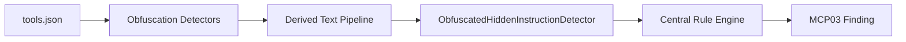

# Detectors 구조 비교 및 선택 권고

비교 대상:

- 현재 프로젝트: `detectors/`
- 비교 대상 폴더: `/Users/yang-geunsang/Downloads/detectors/`

작성일: 2026-06-23

## 1. 결론

장기적으로 선택해야 할 구조는 `/Users/yang-geunsang/Downloads/detectors/` 쪽 구조입니다.

즉, 다음 흐름이 더 적절합니다.



이 구조는 obfuscation detector가 “숨겨진 텍스트를 찾아내는 역할”에 집중하고, MCP03 의도 판정은 중앙 rule engine이 일관되게 수행합니다.

현재 브랜치 구조도 이미 효과는 있습니다. 다만 현재 구조는 각 obfuscation detector 내부에서 직접 `find_best_rule_match()`를 호출하는 방식이라, 단기 개선에는 빠르지만 장기 유지보수와 정책 일관성 측면에서는 다운로드 폴더 구조가 더 좋습니다.

## 2. 한눈에 보는 차이

| 구분 | 현재 프로젝트 `detectors/` | 다운로드 폴더 `Downloads/detectors/` |
| --- | --- | --- |
| MCP03 룰 판단 위치 | `detectors/tool_poisoning/rule_matcher.py`를 각 detector가 직접 호출 | `detectors/rule_engine.py`가 중앙에서 처리 |
| 난독화 결과 전달 방식 | 각 obfuscation detector 내부에서 즉시 판단 | `DerivedMetadataText`로 파생 텍스트를 모아 전달 |
| obfuscated MCP03 전용 detector | 없음 | `tool_poisoning/obfuscated_hidden_instruction.py` 있음 |
| registry 순서 | MCP03 detector 실행 후 obfuscation detector 실행 | obfuscation detector 실행 후 obfuscated hidden instruction detector 실행 |
| 룰 로딩 | `rule_matcher.py`에서 로드, 캐시 없음 | `rule_engine.py`에서 `lru_cache` 적용 |
| 텍스트 정규화 | 일부 helper와 detector별 로직에 분산 | `text_matching.py`로 공통화 |
| regex 방어 | 별도 입력 길이 제한 없음 | `MAX_REGEX_TEXT_CHARS = 4096` 적용 |
| evidence 추적 | `matched_on`, `matched_rule`, `canonical_excerpt`, `transforms` 중심 | `source_location`, `derived_location`, `transformation_chain`, `matched_rules`까지 추적 |
| 책임 분리 | obfuscation 탐지와 MCP03 의도 판정이 일부 섞임 | obfuscation 탐지와 MCP03 의도 판정이 분리됨 |

## 3. 현재 프로젝트 구조

현재 프로젝트는 obfuscation detector들이 직접 MCP03 rule matcher를 호출합니다.

예를 들어 `encoded_payload.py`에서는 디코딩된 payload에 대해 바로 다음 판단을 수행합니다.

```python
rule_match = find_best_rule_match(payload.decoded)
```

`html_comment.py`도 HTML comment 내부의 hidden text를 뽑은 뒤 직접 rule matcher를 호출합니다.

```python
hidden_text = match.group(1).strip()
rule_match = find_best_rule_match(hidden_text)
```

이 구조의 장점은 구현 변경량이 작다는 점입니다. 기존 detector 안에서 디코딩, suspicious phrase 판단, MCP03 rule match, severity 결정, evidence 생성을 한 번에 처리할 수 있습니다.

하지만 단점도 있습니다.

- obfuscation detector가 MCP03 의도 판정까지 함께 담당합니다.
- severity, confidence, recommendation 정책이 detector별로 흩어질 수 있습니다.
- 새 obfuscation detector를 추가할 때 rule matcher 호출을 누락할 수 있습니다.
- 동일한 MCP03 판단 기준을 모든 canonical text에 일관되게 적용하기 어렵습니다.
- “난독화 finding”과 “난독화로 드러난 MCP03 finding”이 report에서 섞여 보일 수 있습니다.

즉, 현재 구조는 실험적으로 효과를 확인하기에는 좋지만, 최종 구조로는 책임이 조금 섞여 있습니다.

## 4. 다운로드 폴더 구조

다운로드 폴더에는 현재 프로젝트에 없는 핵심 파일들이 있습니다.

| 파일 | 역할 |
| --- | --- |
| `obfuscation/derived_text.py` | obfuscation detector들이 만든 canonical text를 공통 객체로 수집 |
| `tool_poisoning/obfuscated_hidden_instruction.py` | derived text를 MCP03 hidden instruction rule로 검사 |
| `rule_engine.py` | YAML rule 로딩, keyword/regex 매칭, rule match 반환 |
| `text_matching.py` | NFKC, casefold, leet 치환, token-gap 기반 keyword matching |

핵심은 `DerivedMetadataText`입니다.

```python
@dataclass(frozen=True)
class DerivedMetadataText:
    value: str
    source_location: str
    derived_location: str
    transform: str
    transformation_chain: tuple[str, ...]
    original_excerpt: str
    decode_confidence: DerivedConfidence
```

이 객체는 단순히 복호화된 문자열만 담지 않습니다. 어디에서 나온 텍스트인지, 어떤 변환을 거쳤는지, 원문 일부가 무엇인지, 디코딩 신뢰도는 어떤지도 함께 담습니다.

그다음 `collect_obfuscation_derived_texts()`가 각 obfuscation detector의 파생 텍스트를 모읍니다.

```python
candidates.extend(derive_encoded_texts(tool))
candidates.extend(derive_unicode_normalized_texts(tool))
candidates.extend(derive_markup_hidden_texts(tool))
candidates.extend(derive_homoglyph_texts(tool))
```

마지막으로 `ObfuscatedHiddenInstructionDetector`가 이 derived text들을 중앙 rule engine에 통과시킵니다.

```python
for derived in collect_obfuscation_derived_texts(tool):
    matches = find_rule_matches(text=derived.value, rules=rules)
    if not matches:
        continue

    findings.append(_build_finding(tool, derived, matches))
```

이 흐름에서는 obfuscation detector가 MCP03을 직접 판단하지 않습니다. obfuscation detector는 숨겨진 텍스트를 찾아 canonical text로 만들고, MCP03 판단은 전용 detector가 맡습니다.

## 5. 왜 다운로드 폴더 구조가 더 적절한가

### 5.1 MCP03 집중도가 높습니다

우리 프로젝트의 핵심 목표는 MCP03 Tool Poisoning 탐지입니다.

따라서 “난독화가 있다”는 사실보다 더 중요한 것은 “난독화를 풀었더니 MCP03 의도가 있느냐”입니다.

다운로드 폴더 구조는 이 흐름을 명확하게 표현합니다.

```text
난독화 발견
→ canonical text 생성
→ MCP03 rule engine으로 의도 판정
→ obfuscated hidden instruction finding 생성
```

이 구조가 발표나 문서화에도 더 설명하기 쉽습니다.

### 5.2 detector 책임이 분리됩니다

현재 구조에서는 `EncodedPayloadDetector`, `HtmlCommentDetector`, `UnicodeObfuscationDetector`, `HomoglyphDetector`가 모두 MCP03 rule matcher를 직접 호출할 수 있습니다.

반면 다운로드 폴더 구조에서는 역할이 나뉩니다.

| 책임 | 담당 |
| --- | --- |
| base64, URL encoding, HTML comment, homoglyph 등 발견 | obfuscation detector |
| 복호화/정규화된 text 생성 | derived text pipeline |
| MCP03 의도 판정 | obfuscated hidden instruction detector |
| keyword/regex matching | central rule engine |

이렇게 나누면 새 난독화 기법을 추가할 때도 해당 detector는 `DerivedMetadataText`만 생성하면 됩니다. MCP03 판단 로직을 다시 구현하거나 복사할 필요가 없습니다.

### 5.3 evidence 품질이 더 좋습니다

다운로드 폴더 구조는 evidence에 다음 정보를 더 체계적으로 남길 수 있습니다.

- `source_location`
- `derived_location`
- `transform`
- `transformation_chain`
- `decode_confidence`
- `original_excerpt`
- `derived_excerpt`
- `matched_rules`

이 정보는 보고서에서 “왜 이 finding이 나왔는지”를 설명할 때 중요합니다.

특히 `transformation_chain`이 있으면 다음처럼 설명할 수 있습니다.

```text
description에서 base64를 디코딩했고,
그 결과 URL encoding을 다시 디코딩했으며,
최종 canonical text가 sensitive_data_steering 룰에 매칭되었습니다.
```

이것은 단순히 `matched_on: canonical`만 있는 것보다 추적성이 좋습니다.

### 5.4 성능과 보안 방어가 더 좋습니다

다운로드 폴더의 `rule_engine.py`는 룰 로딩에 `lru_cache`를 사용합니다.

```python
@lru_cache(maxsize=None)
def _load_rules_cached(rules_path: str) -> tuple[dict[str, Any], ...]:
```

또한 regex 매칭 대상 길이를 제한합니다.

```python
MAX_REGEX_TEXT_CHARS = 4096
match_text = text[:MAX_REGEX_TEXT_CHARS]
```

보안 스캐너는 공격자가 만든 입력을 검사하기 때문에, 긴 텍스트나 복잡한 정규식으로 인한 성능 문제를 조심해야 합니다. 이 점에서 다운로드 폴더 구조가 더 방어적입니다.

### 5.5 keyword matching 우회 대응이 더 좋습니다

다운로드 폴더의 `text_matching.py`는 단순 substring보다 강한 matching을 제공합니다.

- NFKC 정규화
- casefold
- leet 치환
- token-gap matching

예를 들어 `ignore previous instructions`가 약간 변형되어 있어도 공통 matcher에서 더 안정적으로 처리할 수 있습니다.

현재 구조처럼 detector별로 판단이 분산되어 있으면 이런 개선을 모든 경로에 동일하게 적용하기 어렵습니다.

## 6. 현재 구조를 바로 버려야 하는가

바로 버릴 필요는 없습니다.

현재 브랜치의 direct rule matcher 방식은 이미 다음 효과를 확인했습니다.

- base64, URL encoding, HTML entity, ROT13 등 복호화 후 MCP03 의도 탐지
- HTML comment, CSS comment, script tag, homoglyph, zero-width 계열 canonical evidence 추가
- `matched_on`, `matched_rule`, `canonical_excerpt`, `transforms` 기반 evidence 강화
- vulnerable-lab 기준 탐지 케이스 증가

따라서 현재 구조는 “효과 검증 단계”로 의미가 있습니다.

다만 최종 구조는 다운로드 폴더 방식으로 정리하는 것이 좋습니다. 현재 구현에서 얻은 evidence 표현과 테스트 결과를 유지하면서, 판단 위치만 중앙화하는 방향이 가장 안전합니다.

## 7. 권장 선택지

### 선택안 A: 현재 구조 유지

각 obfuscation detector가 직접 `find_best_rule_match()`를 호출하는 방식입니다.

장점:

- 이미 구현되어 있습니다.
- 변경량이 적습니다.
- 테스트와 보고서가 이미 생성되어 있습니다.
- 빠르게 결과를 보여주기 좋습니다.

단점:

- 책임이 섞입니다.
- severity 정책이 분산됩니다.
- 새 detector 추가 시 MCP03 판단 로직 누락 가능성이 있습니다.
- 장기적으로 구조 설명이 어려워질 수 있습니다.

### 선택안 B: 다운로드 폴더 구조로 전환

`derived_text.py`, `obfuscated_hidden_instruction.py`, `rule_engine.py`, `text_matching.py` 중심의 중앙 pipeline입니다.

장점:

- MCP03 의도 판정이 중앙화됩니다.
- obfuscation detector의 책임이 명확해집니다.
- evidence 추적성이 좋아집니다.
- rule loading cache와 regex length limit을 적용할 수 있습니다.
- keyword/regex matching 개선을 한 곳에서 적용할 수 있습니다.
- 발표와 문서화에 더 설득력 있습니다.

단점:

- 변경 범위가 더 큽니다.
- registry 순서가 바뀝니다.
- finding category와 fingerprint가 바뀔 수 있습니다.
- 기존 보고서와 baseline 비교 시 수치가 다시 달라질 수 있습니다.
- unit/integration test 보강이 필요합니다.

## 8. 최종 권고

저는 선택안 B, 즉 다운로드 폴더의 중앙 pipeline 구조를 선택하는 것을 권장합니다.

다만 적용은 한 번에 크게 갈아엎기보다 다음 순서가 좋습니다.

1. `rule_engine.py`와 `text_matching.py`를 먼저 도입합니다.
2. `obfuscation/derived_text.py`를 추가하고 각 obfuscation detector에 `derive_*_texts()` 함수를 붙입니다.
3. `tool_poisoning/obfuscated_hidden_instruction.py`를 추가합니다.
4. registry에서 obfuscation detector 실행 후 `ObfuscatedHiddenInstructionDetector`가 실행되도록 순서를 조정합니다.
5. 기존 obfuscation detector 내부의 직접 `find_best_rule_match()` 호출은 제거하거나 단계적으로 비활성화합니다.
6. evidence에는 현재 브랜치에서 쓰던 `matched_on`, `canonical_excerpt` 표현과 다운로드 폴더의 `transformation_chain`, `matched_rules` 표현을 함께 반영합니다.
7. vulnerable-lab, benign-lab, snyk-aligned test를 다시 돌려 수치 변화를 재검증합니다.

## 9. 발표용 요약

다른 사람에게 설명할 때는 다음처럼 말하면 됩니다.

> 현재 구현은 난독화 detector 내부에서 복호화된 텍스트를 바로 MCP03 rule matcher에 넣는 방식입니다. 이 방식은 빠르게 효과를 확인하기에는 좋지만, detector마다 판단 로직이 섞이는 단점이 있습니다.
>
> 최종 구조는 obfuscation detector가 canonical text만 만들고, 별도의 ObfuscatedHiddenInstructionDetector가 모든 canonical text를 중앙 rule engine에 통과시키는 방식이 더 적절합니다.
>
> 이렇게 하면 난독화 탐지와 MCP03 의도 판정이 분리되고, severity, confidence, evidence, 성능 제한을 한 곳에서 일관되게 관리할 수 있습니다.

한 줄로 정리하면 다음과 같습니다.

> “각 detector가 직접 MCP03을 판단하는 구조”보다 “canonical text를 모아 중앙 MCP03 rule engine에서 일괄 판정하는 구조”가 더 안정적이고 확장성이 좋습니다.

