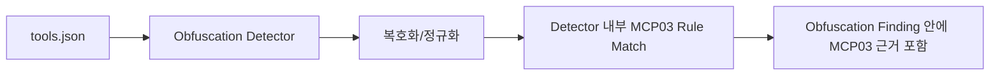

# Vulnerable Lab MCP03 improve 비교 보고서

비교 대상:

- `docs/member 2/vulnerable-lab-detected-mcp03-2026-06-23.md`
- `docs/member 2/vulnerable-lab-detected-mcp03-improve-2026-06-23.md`

작성일: 2026-06-23

## 1. 결론

improve 보고서는 탐지 사례 수를 유지하면서, 난독화 신호와 MCP03 의도 판정을 분리한 구조적 개선을 반영합니다.
기존 보고서는 obfuscation detector 내부에서 MCP03 rule match 결과를 함께 표현했다면, improve 보고서는 `obfuscation.*` finding과 `tool_poisoning.obfuscated_hidden_instruction` finding을 분리합니다.

따라서 전체 finding 수는 증가했지만, 이는 단순 중복 증가라기보다 “난독화 발견”과 “복호화 후 MCP03 의도 확인”을 별도 근거로 보여주기 시작한 영향입니다.

## 2. 요약 지표 비교

| 항목 | 기존 2026-06-23 | improve 2026-06-23 | 변화 |
|---|---:|---:|---:|
| 전체 사례 | 112 | 112 | +0 |
| Finding 발생 사례 | 48 | 48 | +0 |
| Finding 없음 | 64 | 64 | +0 |
| 전체 Finding | 103 | 136 | +33 |
| Detector 오류 | 0 | 0 | +0 |
| Semantic Finding | 27 | 27 | +0 |
| Obfuscation Finding | 33 | 32 | -1 |
| Obfuscated MCP03 Finding | 0 | 28 | +28 |
| Canonical text evidence 포함 Finding | 28 | 44 | +16 |

핵심 변화는 다음과 같습니다.

- Finding 발생 사례는 **48개로 유지**되었습니다.
- 전체 Finding은 **103개에서 136개로 33개 증가**했습니다.
- `tool_poisoning.obfuscated_hidden_instruction`이 **28개 새로 분리**되었습니다.
- Canonical text evidence 포함 finding은 **28개에서 44개로 증가**했습니다.
- Semantic finding은 **27개로 유지**되었습니다.
- Obfuscation finding은 **33개에서 32개로 1개 감소**했습니다.

## 3. 구조 변화

기존 구조는 각 obfuscation detector가 직접 MCP03 rule matcher를 호출해 severity와 evidence를 함께 결정했습니다.

improve 구조는 obfuscation detector가 canonical text를 만들고, 별도 `ObfuscatedHiddenInstructionDetector`가 중앙 `rule_engine`으로 MCP03 의도를 판정합니다.

이 변화 때문에 하나의 케이스에서 `obfuscation.base64`와 `tool_poisoning.obfuscated_hidden_instruction`이 함께 나올 수 있습니다. 전자는 “base64 은닉이 있었다”는 사실이고, 후자는 “base64를 풀어보니 MCP03 룰에 걸렸다”는 의미입니다.

## 4. 심각도 분포 비교

| Severity | 기존 | improve | 변화 |
|---|---:|---:|---:|
| `critical` | 39 | 39 | +0 |
| `high` | 56 | 62 | +6 |
| `medium` | 6 | 32 | +26 |
| `low` | 2 | 3 | +1 |
| `info` | 0 | 0 | +0 |

`medium`이 크게 증가한 이유는 obfuscation 자체 finding이 중간 위험 신호로 분리되고, 실제 MCP03 의도는 별도 `obfuscated_hidden_instruction` finding에서 표현되기 때문입니다.

## 5. 신뢰도 분포 비교

| Confidence | 기존 | improve | 변화 |
|---|---:|---:|---:|
| `high` | 66 | 65 | -1 |
| `medium` | 35 | 67 | +32 |
| `low` | 2 | 4 | +2 |

`medium` 신뢰도가 증가한 것도 같은 이유입니다. obfuscation 자체 발견은 의도 판정보다 낮은 확신도로 남고, canonical text MCP03 판정은 별도 finding으로 분리됩니다.

## 6. 카테고리 변화

| Category | 기존 | improve | 변화 |
|---|---:|---:|---:|
| `hidden_instruction` | 37 | 43 | +6 |
| `semantic_similarity.hidden_instruction` | 22 | 22 | +0 |
| `tool_poisoning.obfuscated_hidden_instruction` | 0 | 28 | +28 |
| `obfuscation.homoglyph` | 8 | 8 | +0 |
| `obfuscation.zero_width_unicode` | 8 | 8 | +0 |
| `semantic_similarity.schema_poisoning` | 5 | 5 | +0 |
| `cross_tool_instruction` | 3 | 3 | +0 |
| `obfuscation.base64` | 3 | 3 | +0 |
| `obfuscation.html_comment` | 3 | 3 | +0 |
| `obfuscation.url_encoding` | 3 | 3 | +0 |
| `obfuscation.css_comment` | 2 | 2 | +0 |
| `obfuscation.script_tag` | 2 | 2 | +0 |
| `tool_poisoning.markdown_hidden_link` | 2 | 2 | +0 |
| `obfuscation.html_entity` | 1 | 1 | +0 |
| `obfuscation.ie_conditional_comment` | 1 | 1 | +0 |
| `obfuscation.octal_escape` | 1 | 1 | +0 |
| `schema_poisoning` | 1 | 1 | +0 |
| `obfuscation.rot13` | 1 | 0 | -1 |

가장 중요한 변화는 `tool_poisoning.obfuscated_hidden_instruction` 카테고리 28건입니다. 이 카테고리는 선택안 B 구조의 핵심 산출물입니다.

## 7. 사례 단위 변화

| 항목 | 건수 |
|---|---:|
| 신규 탐지 사례 | 0 |
| 제외된 탐지 사례 | 0 |
| Finding 구성이 바뀐 공통 사례 | 29 |
| Finding 수 증가 사례 | 25 |
| Finding 수 감소 사례 | 0 |
| Finding 수는 같지만 ID/구성이 바뀐 사례 | 4 |

신규 구조에서도 기존에 탐지되던 48개 사례가 모두 유지되었습니다.

### Finding 수 증가 사례

| 사례 | 시나리오 | 기존 | improve | 주요 변화 |
|---|---|---:|---:|---|
| LAB-025 | `LAB-025-octal-escape-instruction` | 1 | 2 | `mcp03-obfuscated-hidden-ee433079497b`, `mcp03-octal_escape-e080440446e2` |
| LAB-026 | `LAB-026-html-entity-instruction` | 1 | 2 | `mcp03-obfuscated-hidden-c7ed33c5490c`, `mcp03-html_entity-47a5f98581df` |
| LAB-028 | `LAB-028-nfkc-leet-ignore` | 3 | 4 | `MCP03-ignore_previous_instructions` |
| LAB-036 | `LAB-036-base64-instruction` | 1 | 2 | `mcp03-obfuscated-hidden-6a8b2e42f96d`, `mcp03-base64-b35d11660ba2` |
| LAB-037 | `LAB-037-zero-width-obfuscation` | 1 | 3 | `MCP03-ignore_previous_instructions`, `mcp03-obfuscated-hidden-a560a54f229a`, `mcp03-zero-width-f63e8d2dcf03` |
| LAB-038 | `LAB-038-markdown-hidden-link` | 2 | 3 | `MCP03-ignore_previous_instructions` |
| LAB-046 | `LAB-046-html-comment-instruction` | 2 | 3 | `mcp03-obfuscated-hidden-601660c5a1d6`, `mcp03-html-comment-cce0c6885c91` |
| LAB-048 | `LAB-048-url-encoded-instruction` | 2 | 3 | `mcp03-obfuscated-hidden-0b28ed700576`, `mcp03-url_encoding-57fad35ccd19` |
| LAB-050 | `LAB-050-nested-base64-url-instruction` | 2 | 3 | `mcp03-obfuscated-hidden-5f78bdabbe63`, `mcp03-url_encoding-e02cf51020e8`, `mcp03-base64-5f0314d37c66` |
| LAB-051 | `LAB-051-bidi-control-instruction` | 5 | 6 | `mcp03-obfuscated-hidden-0d344598fbd5`, `mcp03-zero-width-08f49ceec043` |
| LAB-052 | `LAB-052-unicode-tag-instruction` | 5 | 6 | `mcp03-obfuscated-hidden-f0081d6f1eb0`, `mcp03-zero-width-52381235f4ab` |
| LAB-053 | `LAB-053-mathematical-alphanumeric-instruction` | 3 | 5 | `MCP03-ignore_previous_instructions`, `mcp03-obfuscated-hidden-1d4badd05b8c`, `mcp03-zero-width-ff0718420e7a` |
| LAB-054 | `LAB-054-combining-mark-instruction` | 5 | 6 | `mcp03-obfuscated-hidden-c29e68c2810c`, `mcp03-zero-width-72098ae9f8d7` |
| LAB-055 | `LAB-055-homoglyph-skeleton-instruction` | 2 | 3 | `mcp03-obfuscated-hidden-6f254295e779`, `mcp03-homoglyph-c4f1219da2f0` |
| LAB-056 | `LAB-056-fullwidth-latin-confusable` | 3 | 5 | `MCP03-ignore_previous_instructions`, `mcp03-obfuscated-hidden-0ea46b43e146`, `mcp03-homoglyph-8f306ed011a6` |
| LAB-057 | `LAB-057-css-comment-instruction` | 4 | 5 | `mcp03-obfuscated-hidden-074bde906717`, `mcp03-css-comment-fc25b5fdc0fb` |
| LAB-058 | `LAB-058-script-tag-instruction` | 4 | 5 | `mcp03-obfuscated-hidden-94745af61b35`, `mcp03-script-tag-514e729f76a6` |
| LAB-059 | `LAB-059-ie-conditional-comment-instruction` | 3 | 4 | `mcp03-obfuscated-hidden-ab5ba8169578`, `mcp03-ie-conditional-comment-0b92bdd8a5b0` |
| LAB-074 | `LAB-074-bidi-script-tag-chain` | 5 | 7 | `mcp03-obfuscated-hidden-dc1ac1ee44a3`, `mcp03-obfuscated-hidden-f1631a678ff4`, `mcp03-script-tag-fac83f3d2108`, `mcp03-zero-width-c940c7a4eb1a` |
| LAB-075 | `LAB-075-homoglyph-css-comment-chain` | 3 | 5 | `mcp03-obfuscated-hidden-5d2caef34d4a`, `mcp03-obfuscated-hidden-c34198cfbfa2`, `mcp03-css-comment-c8825c68c52c`, `mcp03-homoglyph-cb3f15d05225` |
| LAB-077 | `LAB-077-unicode-tag-meta-instruction` | 5 | 6 | `mcp03-obfuscated-hidden-33e13bd430d6`, `mcp03-zero-width-0bc5bb4570c4` |
| LAB-078 | `LAB-078-nfkc-fullwidth-system-gap` | 4 | 5 | `mcp03-obfuscated-hidden-acd1951ec849`, `mcp03-homoglyph-906701fee02b` |
| LAB-079 | `LAB-079-combining-mark-homoglyph-chain` | 5 | 7 | `mcp03-obfuscated-hidden-145bb20fd758`, `mcp03-obfuscated-hidden-81f4a63574cd`, `mcp03-homoglyph-cd48532dcaff`, `mcp03-zero-width-253fcd18a32e` |
| LAB-081 | `LAB-081-nested-base64-meta-rug-pull-note` | 2 | 3 | `mcp03-obfuscated-hidden-c1df4c08cacd`, `mcp03-url_encoding-be80e7a49c32`, `mcp03-base64-6aa6821d6a22` |
| LAB-082 | `LAB-082-multi-obfuscation-exfiltration-chain` | 3 | 6 | `mcp03-obfuscated-hidden-12dcbb68536d`, `mcp03-obfuscated-hidden-82a6bc2b2e63`, `MCP03-ignore_previous_instructions`, `mcp03-homoglyph-974e53f0cc40`, ... |

### Finding 수는 같지만 구성이 바뀐 사례

| 사례 | 시나리오 | 해석 |
|---|---|---|
| LAB-027 | `LAB-027-rot13-instruction` | fingerprint 또는 category 표현이 바뀐 사례입니다. 구조 변경으로 evidence 구성과 ID hash가 달라진 영향으로 봐야 합니다. |
| LAB-031 | `LAB-031-html-comment-benign-control` | fingerprint 또는 category 표현이 바뀐 사례입니다. 구조 변경으로 evidence 구성과 ID hash가 달라진 영향으로 봐야 합니다. |
| LAB-032 | `LAB-032-mixed-script-benign-control` | fingerprint 또는 category 표현이 바뀐 사례입니다. 구조 변경으로 evidence 구성과 ID hash가 달라진 영향으로 봐야 합니다. |
| LAB-049 | `LAB-049-homoglyph-secret-request` | fingerprint 또는 category 표현이 바뀐 사례입니다. 구조 변경으로 evidence 구성과 ID hash가 달라진 영향으로 봐야 합니다. |

## 8. 대표 개선 사례

- LAB-025 `LAB-025-octal-escape-instruction`: improve 보고서에서 obfuscation 신호와 `obfuscated_hidden_instruction`이 분리되어, “숨김 방식”과 “MCP03 의도”를 따로 확인할 수 있습니다.
- LAB-026 `LAB-026-html-entity-instruction`: improve 보고서에서 obfuscation 신호와 `obfuscated_hidden_instruction`이 분리되어, “숨김 방식”과 “MCP03 의도”를 따로 확인할 수 있습니다.
- LAB-027 `LAB-027-rot13-instruction`: improve 보고서에서 obfuscation 신호와 `obfuscated_hidden_instruction`이 분리되어, “숨김 방식”과 “MCP03 의도”를 따로 확인할 수 있습니다.
- LAB-036 `LAB-036-base64-instruction`: improve 보고서에서 obfuscation 신호와 `obfuscated_hidden_instruction`이 분리되어, “숨김 방식”과 “MCP03 의도”를 따로 확인할 수 있습니다.
- LAB-050 `LAB-050-nested-base64-url-instruction`: improve 보고서에서 obfuscation 신호와 `obfuscated_hidden_instruction`이 분리되어, “숨김 방식”과 “MCP03 의도”를 따로 확인할 수 있습니다.
- LAB-074 `LAB-074-bidi-script-tag-chain`: improve 보고서에서 obfuscation 신호와 `obfuscated_hidden_instruction`이 분리되어, “숨김 방식”과 “MCP03 의도”를 따로 확인할 수 있습니다.
- LAB-075 `LAB-075-homoglyph-css-comment-chain`: improve 보고서에서 obfuscation 신호와 `obfuscated_hidden_instruction`이 분리되어, “숨김 방식”과 “MCP03 의도”를 따로 확인할 수 있습니다.
- LAB-079 `LAB-079-combining-mark-homoglyph-chain`: improve 보고서에서 obfuscation 신호와 `obfuscated_hidden_instruction`이 분리되어, “숨김 방식”과 “MCP03 의도”를 따로 확인할 수 있습니다.
- LAB-082 `LAB-082-multi-obfuscation-exfiltration-chain`: improve 보고서에서 obfuscation 신호와 `obfuscated_hidden_instruction`이 분리되어, “숨김 방식”과 “MCP03 의도”를 따로 확인할 수 있습니다.

## 9. 해석상 주의사항

- finding ID hash는 evidence 구조와 fingerprint 재료가 바뀌면 달라질 수 있습니다. 따라서 `mcp03-base64-*`, `mcp03-zero-width-*` 같은 ID hash 변화는 새 공격 유형 추가로만 해석하면 안 됩니다.
- improve 구조에서는 같은 악성 문장에 대해 obfuscation finding과 obfuscated MCP03 finding이 함께 생성될 수 있습니다. 수치 비교 시 단순 finding 개수보다 category 의미를 먼저 봐야 합니다.
- 전체 finding이 증가했지만 탐지 사례 수는 동일합니다. 즉 이번 변화의 핵심은 recall 증가보다 evidence 구조 개선과 책임 분리입니다.

## 10. 최종 평가

improve 구조는 기존 탐지 범위를 유지하면서 결과를 더 설명 가능한 형태로 바꾸었습니다.
특히 난독화 detector가 MCP03 판단까지 직접 담당하던 구조에서 벗어나, canonical text를 중앙 rule engine에 통과시키는 구조로 전환된 점이 가장 중요합니다.

따라서 이번 개선은 “더 많은 사례를 잡는 개선”이라기보다, “같은 탐지를 더 명확한 책임 분리와 더 좋은 evidence로 설명하는 개선”에 가깝습니다.
