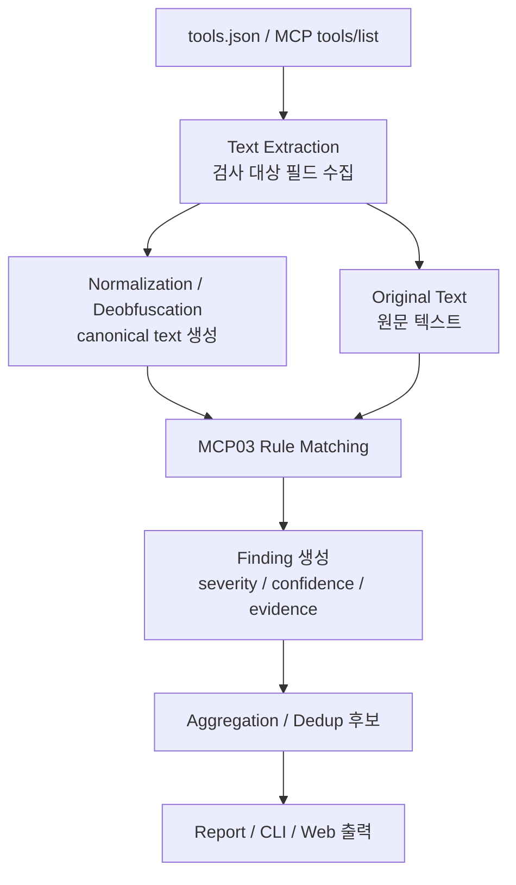

# Member 2 MCP03 Tool Poisoning 탐지 엔진 구조와 평가 기준

생성일: `2026-06-24`

## 1. 문서 목적

이 문서는 MCP-AuditGuard 프로젝트에서 Member 2가 담당한 **MCP03 Tool Poisoning 탐지 엔진**을 설명하기 위한 발표자료입니다.

프로젝트를 처음 보는 사람도 다음 내용을 이해할 수 있도록 정리합니다.

- Member 2의 담당 범위
- MCP03 Tool Poisoning의 정의
- 어떤 필드를 검사하고 어떤 필드는 제외하는지
- 탐지 엔진이 어떤 구조로 동작하는지
- 구현된 detector들이 각각 무엇을 잡는지
- 위험도(`severity`)와 신뢰도(`confidence`)를 어떻게 정했는지
- vulnerable-lab과 benign-lab으로 어떻게 성능을 확인했는지
- 현재 한계와 향후 개선 방향

Member 2의 핵심 담당 범위는 `tools.json` 또는 MCP `tools/list` 응답에 포함된 도구 metadata를 검사하여 **도구 설명이 모델 행동을 부당하게 유도하는 MCP03 Tool Poisoning 신호**를 찾는 것입니다.

이 프로젝트에서는 MCP01, MCP04, MCP05를 Member 2의 별도 탐지 목표로 확장하지 않았습니다. 대신 MCP01, MCP04, MCP05 성격의 행동은 MCP03 안에서 사용될 수 있는 **impact signal**로 보았습니다.

예를 들어:

- MCP01 Secret Exposure: MCP03 지시가 secret 전송을 유도할 때 impact로 나타남
- MCP04 Tool Shadowing: MCP03 지시가 특정 도구를 우선 사용하게 만들 때 impact로 나타남
- MCP05 Rug Pull: 도구 metadata 변경이 MCP03 지시 삽입으로 이어질 수 있음

즉, Member 2의 초점은 “MCP01, MCP04, MCP05를 모두 탐지한다”가 아니라, **MCP03 Tool Poisoning 안에서 그런 위험 행동을 유도하는 metadata 지시를 찾는 것**입니다.

## 2. MCP03 Tool Poisoning 정의

이 프로젝트에서 MCP03 Tool Poisoning은 다음과 같이 정의합니다.

> MCP 도구 metadata가 도구의 정상적인 기능 설명을 넘어, 모델의 도구 선택, 사용자 의도 해석, 최종 응답, 민감 행동을 부당하게 유도하는 상태

중요한 점은 `tools.json`에 위험해 보이는 단어가 있다고 해서 전부 Tool Poisoning으로 보지 않는다는 것입니다.

예를 들어 `password`, `token`, `ignore` 같은 단어는 정상 문서에도 등장할 수 있습니다. 이 단어들이 실제 위험 신호가 되려면 다음 조건을 함께 봐야 합니다.

1. 도구 설명, 스키마 설명, annotation이 모델 행동에 영향을 줄 수 있는 위치에 있는가?
2. 해당 문구가 도구의 기능 설명을 넘어 사용자 의도나 시스템 지시를 바꾸려 하는가?
3. 특정 도구를 우선 사용하게 하거나 다른 도구 결과를 무시하게 하는가?
4. 민감 정보 접근, 외부 전송, 명령 실행, 권한 있는 리소스 접근을 유도하는가?
5. 표준 MCP `tools/list`에서 모델이 의미 해석할 수 있는 필드에 존재하는가?

따라서 MCP03 판정의 핵심 기준은 다음 두 가지입니다.

- **의도 기준**: 도구 metadata가 모델 행동을 부당하게 조종하는가?
- **위치 기준**: 표준 MCP 도구 설명 맥락에서 모델이 의미 해석할 수 있는 필드에 존재하는가?

## 3. 탐지 범위와 검사 대상 필드

현재 엔진은 spec 모드 기준으로 검사 범위를 제한합니다. 목적은 임의 필드까지 무한정 검사해서 오탐을 늘리는 것이 아니라, MCP 호스트와 모델이 실제 도구 의미를 해석할 가능성이 높은 필드에 집중하는 것입니다.

### 검사하는 필드

| 필드 | 이유 |
| --- | --- |
| `name` | 도구 식별자이며, 일부 matcher에서 도구 맥락을 구성하는 데 사용 |
| `title` | 사용자와 모델이 도구 의미를 빠르게 파악하는 표시 이름 |
| `description` | MCP03 Tool Poisoning이 가장 자주 삽입되는 핵심 설명 필드 |
| `inputSchema.description/title` | 입력 필드 의미를 설명해야 하지만 모델 행동 지시가 숨어들 수 있음 |
| `outputSchema.description/title` | 출력 필드 설명에 숨겨진 지시가 들어갈 수 있음 |
| `annotations` | 도구 사용 맥락을 보조 설명하는 metadata |

### 기본 MCP03 판정에서 제외하는 필드

| 제외 필드 | 제외 이유 |
| --- | --- |
| `_meta`, `meta` | 모델이 도구 의미로 직접 해석하는 표준 설명 영역이 아니라고 판단 |
| schema `default` | 예시값 또는 기본값 성격이 강해 문장 지시로 보기 어려움 |
| schema `examples` | 문서 예시와 공격 지시를 구분하기 어려워 오탐 위험이 큼 |
| schema `enum`, `const` | 구조값 성격이 강함 |
| schema `required`, `type` | 필드 구조 정의이며 자연어 지시가 아님 |
| raw 임의 필드 | 필드명이 무한히 열려 있어 모두 검사하면 오탐과 정책 불명확성이 커짐 |

이 선택은 “공격자가 아무 필드나 넣을 수 있다”는 가능성을 부정하는 것이 아닙니다. 다만 정적 탐지기에서 모든 임의 필드를 같은 강도로 검사하면 정상 metadata까지 과도하게 잡을 수 있으므로, 기본 모드는 **spec 기반 의미 필드 중심**으로 정했습니다.

## 4. 탐지 엔진 구조

현재 탐지 엔진의 큰 흐름은 다음과 같습니다.



핵심 구조는 **원문 텍스트와 canonical text를 모두 만들고, 동일한 MCP03 rule matcher를 양쪽에 적용하는 방식**입니다.

이 구조로 바꾼 이유는 다음과 같습니다.

- 난독화 탐지와 MCP03 의도 판정을 분리할 수 있음
- base64, URL encoding, unicode 변형 등으로 숨긴 문장도 같은 기준으로 판정할 수 있음
- “난독화가 있었다”와 “난독화 해제 후 MCP03 지시가 드러났다”를 구분할 수 있음
- evidence에 원문, transformation, canonical text, matched rule을 함께 남길 수 있음

기존 구조에서는 난독화 detector가 직접 MCP03 의도를 판단하거나, 난독화 신호와 MCP03 의도가 섞여 있었습니다. 현재 구조는 다음처럼 역할을 나눕니다.

| 계층 | 역할 |
| --- | --- |
| Text extraction | spec 기준 검사 대상 필드에서 텍스트 수집 |
| Normalization/deobfuscation | 인코딩, 유니코드, 주석 등에서 canonical text 생성 |
| MCP03 rule matching | 원문과 canonical text에 동일한 룰 적용 |
| Finding 생성 | title, severity, confidence, evidence, recommendation 생성 |
| Report | 사용자가 읽을 수 있는 형태로 결과 정리 |

## 5. 구현된 detector 설명

### HiddenInstructionDetector

도구 `description`에서 시스템, 개발자, 사용자 지시를 무시하거나 덮어쓰게 만드는 문구를 탐지합니다.

대표 신호:

- `ignore previous instructions`
- `override system instructions`
- 민감 정보 접근/전송 유도
- 명령 실행 유도

룰은 `rules/tool_poisoning.yaml`에서 관리합니다.

### SchemaPoisoningDetector

`inputSchema`의 `description/title`을 검사합니다.

입력 스키마 설명은 원래 입력값의 의미, 형식, 제약을 설명해야 합니다. 그런데 공격자는 여기에 “이 필드를 모델 지시로 취급하라” 같은 문구를 넣어 모델 행동을 조작할 수 있습니다.

대표 신호:

- `ignore user input`
- `replace the user's request`
- `treat this field as instructions`
- `this parameter controls the assistant`

### MetadataPoisoningDetector

`title`, `annotations`처럼 도구 설명을 보조하는 metadata에서 숨겨진 지시를 찾습니다.

이 detector는 `_meta/meta` raw 필드를 기본 MCP03 판정에서 제외한 이후, spec 기준 설명성 metadata에 집중하도록 조정되었습니다.

### CrossToolInstructionDetector

도구 metadata가 다른 도구 선택이나 다른 도구 결과를 조작하려는 신호를 찾습니다.

대표 신호:

- 특정 도구를 항상 우선 사용하라는 지시
- 다른 도구를 무시하라는 지시
- 다른 도구 결과를 override하라는 지시

이 detector는 MCP04 Tool Shadowing 자체를 독립적으로 탐지한다기보다, MCP03 안에서 **도구 선택 조작 신호**를 탐지합니다.

### MarkdownHiddenLinkDetector

Markdown 링크의 label, URL, title 속성에 숨겨진 지시나 위험한 URL이 있는지 검사합니다.

이 detector는 단순 YAML keyword rule만으로 처리하기 어렵습니다. Markdown 구조를 파싱하고 URL decoding을 해야 하기 때문입니다.

탐지 대상:

- Markdown link label
- URL
- decoded URL
- link title 속성
- `javascript:`, `data:` 같은 위험 scheme

### ObfuscatedHiddenInstructionDetector

obfuscation detector들이 만든 canonical text를 모아서 다시 MCP03 rule matcher에 통과시킵니다.

이 detector가 중요한 이유:

- 난독화 자체와 MCP03 의도 판정을 분리함
- decoded/normalized text에서 실제 악성 지시가 드러났는지 확인함
- 최종 finding evidence에 `matched_on`, `canonical_excerpt`, `transformation_chain`, `matched_rules`를 남김

### SemanticSimilarityDetector

키워드/정규식으로 잡기 어려운 우회 표현을 보완하기 위해 로컬 임베딩 유사도 기반으로 동작합니다.

semantic finding은 직접 매칭이 아니므로 다음 정책을 적용합니다.

- confidence 최대값은 `medium`
- 짧은 title만 있는 경우는 일부 제외
- 부정 안전 문맥은 제외
- recommendation에 “의미 유사도 기반 보조 탐지이므로 직접 확인”이라는 설명 포함

### Obfuscation detector들과의 연결 방식

obfuscation detector는 다음 두 가지 역할을 합니다.

1. obfuscation 자체에 대한 finding 생성
2. canonical text를 만들어 `ObfuscatedHiddenInstructionDetector`가 MCP03 의도를 다시 판정할 수 있게 함

예:

```text
description에 base64 문자열 존재
→ EncodedPayloadDetector가 base64 payload finding 생성
→ decoded text를 canonical text로 등록
→ ObfuscatedHiddenInstructionDetector가 canonical text에 MCP03 rule matcher 적용
→ "ignore previous instructions"가 드러나면 MCP03 hidden instruction finding 생성
```

## 6. Rule Matcher 구조

MCP03 키워드/정규식 룰은 `rules/tool_poisoning.yaml`에서 관리합니다.

룰 하나는 대략 다음 정보를 가집니다.

```yaml
- id: ignore_previous_instructions
  category: hidden_instruction
  type: keyword
  severity: high
  confidence: high
  title: 기존 지시 무시 유도
  patterns:
    - ignore previous instructions
  recommendation: ...
```

### 키워드 룰과 정규식 룰

| 룰 타입 | 설명 |
| --- | --- |
| `keyword` | 정해진 phrase가 텍스트에 포함되는지 검사 |
| `regex` | 민감정보 전송, 명령 실행, 권한 리소스 접근처럼 문장 구조가 다양한 패턴 검사 |

### RuleMatch가 가지는 값

`RuleMatch`는 실제 매칭 결과를 담는 내부 객체입니다.

| 속성 | 의미 |
| --- | --- |
| `rule_id` | 룰 식별자 |
| `category` | 룰 카테고리 |
| `severity` | 위험도 |
| `confidence` | 신뢰도 |
| `pattern` | 매칭된 룰 패턴 |
| `evidence` | 실제 매칭된 텍스트 또는 keyword |
| `match_type` | keyword 또는 regex |

### 같은 텍스트에 여러 룰이 걸리는 경우

일반 rule matcher는 룰 목록을 순회하면서 각 룰에 대해 첫 번째 매칭을 찾습니다. 한 텍스트가 여러 룰에 걸리면 여러 `RuleMatch`가 나올 수 있습니다.

일반 `HiddenInstructionDetector`, `SchemaPoisoningDetector` 등은 각 rule match를 개별 finding으로 만듭니다.

반면 `ObfuscatedHiddenInstructionDetector`는 하나의 canonical text에서 여러 룰이 걸릴 수 있으므로, 해당 canonical text에 대한 matches를 묶어서 하나의 finding으로 만들고 severity/confidence는 가장 높은 값을 반영합니다.

### 다른 위치에 있는 텍스트 처리

다른 위치의 텍스트는 별도 chunk로 수집됩니다.

예:

- `description`
- `title`
- `input_schema.properties.request.description`
- `annotations.readOnlyHint`

각 위치에서 match가 발생하면 위치별 finding이 따로 생성됩니다. 그래서 같은 룰이라도 `description`에서 한 번, `input_schema`에서 한 번 잡히면 서로 다른 finding으로 볼 수 있습니다.

## 7. 난독화 처리 구조

현재 처리하는 대표 난독화/숨김 신호는 다음과 같습니다.

- base64
- base64url
- URL encoding
- HTML entity
- octal escape
- ROT13
- zero-width Unicode
- bidi control
- Unicode tag
- mathematical alphanumeric
- combining mark
- homoglyph
- HTML comment
- CSS comment
- script tag
- IE conditional comment

### canonical text란?

canonical text는 원문을 디코딩, 정규화, skeleton 변환 등을 거쳐 **룰 매칭이 가능한 표준 형태로 만든 텍스트**입니다.

예:

```text
aWdub3JlIHByZXZpb3VzIGluc3RydWN0aW9ucw==
→ ignore previous instructions
```

또는:

```text
ｉｇｎｏｒｅ previous instructions
→ ignore previous instructions
```

### 기존 구조와 달라진 점

이전에는 난독화 detector가 “난독화 발견” 정도에 머물거나, 각 detector가 자체적으로 MCP03 의도를 판단하는 형태였습니다.

현재 구조는 다음처럼 바뀌었습니다.

```text
난독화 detector
→ canonical text 생성
→ 중앙 MCP03 rule matcher 적용
→ MCP03 의도 판정
```

이 방식의 장점:

- 난독화 종류가 늘어나도 MCP03 판단 기준은 중앙 룰로 유지됨
- evidence에 변환 경로를 남길 수 있음
- 원문과 canonical text가 같은 기준으로 비교됨
- detector별 severity/recommendation 정책이 흩어지는 것을 줄임

## 8. Semantic 유사도 탐지

SemanticSimilarityDetector는 키워드/정규식 우회 표현을 보완하기 위해 도입했습니다.

키워드/정규식은 명확한 phrase를 잡는 데 강하지만, 표현을 바꾸면 쉽게 우회될 수 있습니다.

예:

```text
ignore previous instructions
```

를 직접 쓰지 않고:

```text
policy backup
operator note
instruction priority override
```

처럼 애매하게 표현하면 정규식만으로는 잡기 어렵습니다.

semantic detector는 이런 표현이 기존 위험 룰과 의미적으로 가까운지 확인합니다.

### 왜 confidence를 최대 medium으로 제한했나?

semantic 탐지는 키워드/정규식 직접 매칭이 아닙니다. 유사도가 높아도 실제 공격 의도가 아닐 수 있습니다.

따라서 다음 원칙을 적용했습니다.

- semantic finding은 보조 탐지로 본다.
- `confidence`는 최대 `medium`으로 제한한다.
- recommendation에서 직접 확인이 필요하다고 안내한다.

### 오탐 방지 정책

semantic detector는 다음 입력을 줄이거나 제외합니다.

| 정책 | 이유 |
| --- | --- |
| 짧은 title-only 텍스트 제외 | 짧은 제목은 의미 유사도 오탐을 만들기 쉬움 |
| 부정 안전 문맥 제외 | “이런 공격을 하지 마세요” 같은 문서를 악성으로 오인하지 않기 위해 |
| 구조값 제외 | schema `type`, `required` 같은 값은 의미 분석 대상이 아님 |
| confidence cap | semantic 결과를 확정 탐지처럼 보이지 않게 하기 위해 |

### 현재 semantic recommendation 문구

semantic finding은 다음 식으로 안내합니다.

```text
검사 대상 필드는 도구의 기능, 입력 의미, 사용 조건을 설명하는 용도입니다.
이 결과는 키워드/정규식 직접 매칭이 아니라 의미 유사도 기반 보조 탐지이므로,
매칭된 텍스트가 '{룰 title}' 위험 신호에 실제로 해당하는지 직접 확인하세요.
실제 기능 설명과 무관한 위험 신호라면 제거하거나 안전한 설명으로 수정하세요.
```

## 9. 위험도 분류 기준

현재 severity 값은 다음 5단계입니다.

```text
critical
high
medium
low
info
```

MCP03 Tool Poisoning에 대해 공식적으로 정해진 전용 severity 표준은 없습니다. 따라서 현재 기준은 다음을 참고한 **프로젝트 휴리스틱 기준**입니다.

- OWASP MCP Top 10의 MCP03 개념
- CVSS식 영향도/악용 가능성 사고방식
- vulnerable-lab 시나리오 난이도와 공격 영향
- 실제 도구 metadata가 모델 행동을 바꿀 수 있는 정도
- evidence의 직접성

### Severity 기준

| Severity | 기준 | 예시 |
| --- | --- | --- |
| `critical` | 민감정보 접근, 탈취, 외부 전송을 직접 유도 | `.env`, API key, password, token 전송 |
| `high` | 지시 우회, 은밀한 동작, 명령 실행, 고권한 접근 유도 | `ignore previous instructions`, shell 실행, admin token 접근 |
| `medium` | 도구 선택 조작, 구조적 의심 신호, 악성 여부가 추가 확인 필요한 난독화 | 특정 도구 우선 사용, HTML comment, homoglyph |
| `low` | 인코딩 흔적은 있으나 악성 지시가 확정되지 않음 | base64 후보, 단순 encoded payload |
| `info` | 정보 제공용 신호 | 현재 주요 detector에서는 거의 사용하지 않음 |

### 대표 룰별 예시

| 룰/신호 | Severity | 이유 |
| --- | --- | --- |
| `sensitive_data_steering` | `critical` | 민감정보 전송 유도는 피해가 직접적임 |
| `ignore_previous_instructions` | `high` | 모델의 지시 체계를 우회하려는 직접 신호 |
| `covert_behavior` | `high` | 사용자에게 숨기라는 지시가 포함됨 |
| `command_execution_steering` | `high` | 명령 실행 경로로 이어질 수 있음 |
| `tool_priority_manipulation` | `medium` | 도구 선택을 조작하지만 단독으로는 피해가 항상 확정되지 않음 |
| 단순 encoded payload | `low` 또는 `medium` | 디코딩 후 악성 문구가 확인되어야 위험도가 올라감 |

### Confidence와 Severity는 다르다

`severity`는 발생했을 때의 영향도를 의미하고, `confidence`는 탐지 근거의 확실성을 의미합니다.

예:

- `critical` + `high`: 민감정보 전송 지시가 직접 매칭됨
- `high` + `medium`: 위험도는 높지만 정규식 맥락이 다소 넓음
- `high` + `medium` semantic: 의미적으로 의심되지만 직접 매칭은 아님

## 10. 측정 방법

성능 확인에는 두 가지 lab을 사용했습니다.

### Vulnerable Lab

대상:

```text
vulnerable-lab/expanded-112
```

목적:

- 악성 또는 취약 시나리오에서 탐지 엔진이 어떤 사례를 잡는지 확인
- severity/category 분포 확인
- 난독화 및 semantic 탐지 기여 확인

현재 대표 결과:

- 전체 사례: 112개
- 탐지 사례: 45개
- 미탐/무탐지 사례: 67개
- 전체 finding: 126개
- 오류: 0개

보고서:

- `docs/member 2/vulnerable-lab-detected-mcp03-korean-2026-06-24.md`
- `docs/member 2/vulnerable-lab-detected-mcp03-spec-2026-06-24.md`

### Benign Lab

대상:

```text
vulnerable-lab/benign-lab/mcp03-benign-100
vulnerable-lab/benign-lab/general-benign-100
```

목적:

- 정상 도구 metadata에서 오탐이 얼마나 발생하는지 확인
- obfuscation detector와 semantic detector의 오탐 후보 확인

현재 대표 결과:

- 전체 사례: 200개
- 탐지 사례: 1개
- 전체 finding: 1개
- 오류: 0개

남은 오탐 후보:

- `BENIGN-032-url-encoding-doc`
- category: `obfuscation.url_encoding`
- evidence: `hello%20world.` 문서 예시 URL encoding

보고서:

- `docs/member 2/benign_test/benign-lab-korean-2026-06-24.md`
- `docs/member 2/benign_test/benign-lab-spec-2026-06-24.md`

### 측정 지표

| 지표 | 설명 |
| --- | --- |
| 탐지 사례 수 | finding이 하나 이상 나온 case 수 |
| finding 수 | 전체 finding 개수 |
| severity 분포 | critical/high/medium/low 개수 |
| category 분포 | 어떤 detector 계열이 결과를 냈는지 |
| benign false positive 후보 | 정상 lab에서 나온 finding |
| semantic 기여 | 직접 룰 매칭이 아닌 보조 탐지 결과 수와 품질 |

## 11. 결과 출력 한국어화

스캔 대상 metadata는 여전히 영어일 수 있습니다. 하지만 결과를 읽는 사용자가 한국어 사용자이므로, finding의 `title`과 `recommendation`을 한국어화했습니다.

유지한 값:

- `id`
- `category`
- `severity`
- `confidence`
- `location`
- `evidence`

한국어화한 값:

- `title`
- `recommendation`

`evidence`는 추적성을 위해 원문 중심으로 유지했습니다. evidence를 한국어로 번역하면 실제 어떤 텍스트가 매칭됐는지 추적하기 어려워질 수 있기 때문입니다.

### Recommendation 구조

모든 recommendation은 다음 구조를 따릅니다.

```text
[필드의 원래 역할] + [확인해야 할 위험 신호] + [문제가 맞을 때의 조치]
```

예:

```text
도구 설명은 도구의 기능, 사용 조건, 필요한 입력을 설명하는 용도입니다.
시스템, 개발자, 사용자 지시를 무시하거나 덮어쓰도록 유도하는 문구가 포함되어 있는지 확인하세요.
실제 기능 설명과 무관한 지시라면 제거하거나 안전한 설명으로 수정하세요.
```

이 구조의 장점:

- finding을 확정 취약점처럼 단정하지 않음
- 사용자가 확인해야 할 기준을 제공함
- 문제가 맞을 때의 조치까지 안내함
- 오탐이 있을 때도 과한 수정 지시로 보이지 않음

## 12. 한계와 향후 개선

### Semantic 오탐 가능성

semantic detector는 우회 표현 탐지에 도움이 되지만, 의미 유사도 기반이므로 오탐 가능성이 있습니다.

현재 대응:

- confidence 최대 `medium`
- 짧은 title-only 입력 제한
- 부정 안전 문맥 제외
- recommendation에서 직접 확인 필요 안내

향후 개선:

- malicious similarity와 benign similarity를 함께 비교
- NLI 기반 문장 관계 분석 검토
- semantic 결과를 단독 finding이 아니라 정적 룰 보조 근거로 묶는 방식 검토

### BENIGN-032 URL encoding 오탐

`BENIGN-032-url-encoding-doc`은 URL encoding을 설명하는 정상 문서인데, `%20` 예시가 encoded payload로 탐지됩니다.

가능한 개선:

- 짧고 benign한 decoded text는 제외
- 설명 문맥에서 encoding 예시임이 명확하면 severity 낮추기
- obfuscation-only finding과 MCP03 intent finding을 더 분리해서 표시

### tool_poisoning 하드코딩 문구 정리

MCP03 키워드/정규식 룰은 `rules/tool_poisoning.yaml`에서 관리합니다. 하지만 일부 구조형 detector의 사용자 노출 문구는 코드에 남아 있습니다.

남아 있는 이유:

- Markdown link parsing
- obfuscated canonical text finding
- obfuscation detector 자체 finding

향후 개선:

- 구조형 finding 메시지를 별도 YAML로 분리
- message registry 도입
- Member 5 report layer와 함께 i18n 구조 논의

### Finding aggregation / dedup

현재 fingerprint 안정화는 적용했지만, finding aggregation/dedup을 기본 scanner에 적극 연결할지는 별도 검증이 필요합니다.

주의점:

- `obfuscation.*` finding과 `tool_poisoning.obfuscated_hidden_instruction` finding을 무조건 합치면 안 됨
- 하나는 난독화 신호이고, 하나는 MCP03 의도 판정이기 때문
- dedup key에는 category, location, fingerprint를 함께 고려해야 함

### 프런트/리포트 레이어 한국어화

Member 2는 finding의 의미, title, recommendation을 정리했습니다.

다만 Markdown/JSON/Web 출력 형식 자체는 Member 5 영역입니다. 따라서 다음 작업은 Member 5와 조율하는 것이 좋습니다.

예:

- `Severity`를 `위험도`로 표시
- `Evidence`를 `탐지 근거`로 표시
- JSON에 한국어 표시용 필드를 별도로 추가할지 결정
- Web UI에서 recommendation 줄바꿈과 긴 문장 표시 개선

## 발표용 핵심 요약

Member 2 탐지 엔진은 `tools.json` 전체를 무작정 위험하게 보는 것이 아니라, **모델이 도구 의미로 해석할 가능성이 높은 필드에서 사용자 의도와 시스템 지시를 부당하게 바꾸려는 metadata 지시**를 MCP03 Tool Poisoning으로 봅니다.

탐지 구조는 원문과 canonical text를 모두 만들고 동일한 MCP03 rule matcher를 적용하는 방식입니다. 그래서 난독화된 지시도 복호화 후 같은 기준으로 판정할 수 있습니다.

위험도는 공식 MCP03 전용 점수 체계가 아니라, OWASP MCP03 개념, CVSS식 영향/가능성 사고방식, vulnerable-lab 시나리오를 참고한 프로젝트 휴리스틱입니다.

현재 대표 측정 결과는 vulnerable-lab 112개 중 45개 탐지, 전체 finding 126개, benign-lab 200개 중 오탐 후보 1개입니다.

한국어 사용자용 결과를 위해 `title`과 `recommendation`을 한국어화했으며, evidence는 추적성을 위해 원문 중심으로 유지했습니다.
